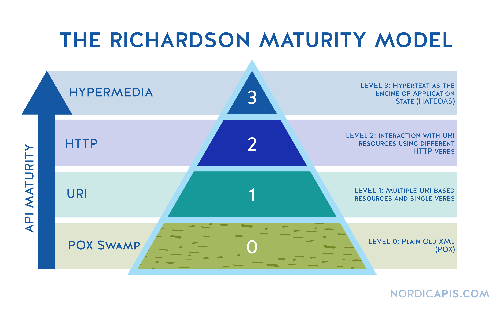

## What is HATEOAS?
HATEOAS, or Hypermedia as the Engine of Application State, is a complicated-sounding term for a simple idea:

> A client interacts with a REST API entirely through the responses provided dynamically by the server.

Put even more simply:

> You shouldn’t need any documentation or out-of-band information to use a REST API.

## The Richardson Maturity Model

## Documentation
You can find the Spring HATEOAS documentation [on this website](https://spring.io/projects/spring-hateoas).